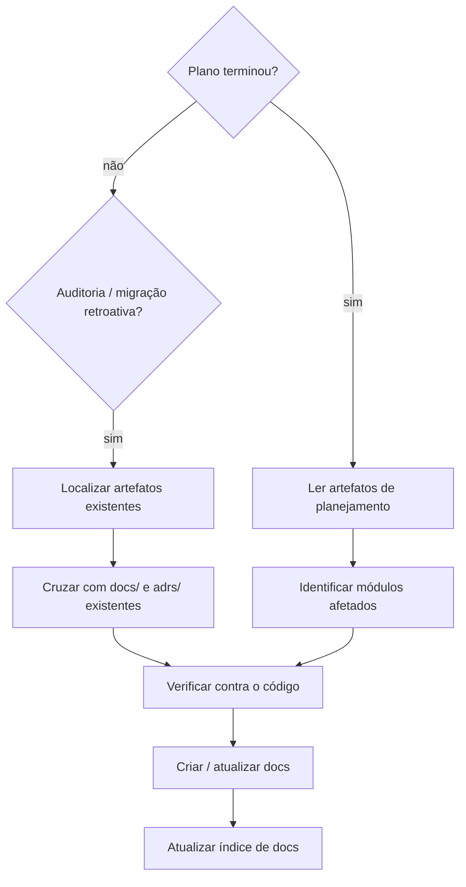

# Documentação Viva

## Visão Geral

Converte artefatos de planejamento (specs, planos, issues, PRs) em documentação estruturada e viva, fiel ao código atual — não à intenção original do design.

**Princípio central:** Docs descrevem o que o sistema *faz*, verificado no código. Descarte qualquer coisa que a spec planejou mas o código não entregou.

## Estrutura de Pastas

```
docs/
  adrs/
    NNN-<titulo>.md               # Um ADR por decisão arquitetural
  features/
    <modulo>/
      prd.md                      # Propósito de negócio e valor para o usuário
      bdd.md                      # Comportamentos observáveis (Dado/Quando/Então)
      reference.md                # Contratos de API, config, uso
      <outro>.md                  # Qualquer doc adicional (diagramas, runbook, etc.)
```

**Nomes de módulo** mapeiam o domínio de negócio, não o pacote/diretório de código. Descubra os módulos lendo o código — não assuma nomes.

## Tipos de Doc

### PRD (Product Requirements Doc)
**Propósito:** Por que esta feature existe? Quem usa? Que problema resolve?
**Audiência:** PMs, novatos, não-engenheiros

```markdown
# <Feature> — PRD

## Objetivo
Um parágrafo: o problema sendo resolvido.

## Usuários
Quem se beneficia e como.

## Escopo
O que está no escopo. O que está explicitamente fora.

## Comportamentos-chave
Lista com os 3–7 comportamentos mais importantes do ponto de vista de negócio.
```

### ADR (Architecture Decision Record)
**Propósito:** Documentar *por que* uma decisão arquitetural não-óbvia foi tomada.
**Criar apenas quando:** A decisão tem tradeoffs reais e mantenedores futuros questionariam.
**Numeração:** Inteiros sequenciais, zero-padded em 3 dígitos (`001`, `002`, …).

```markdown
# ADR-NNN: <Título>

**Status:** Aceito | Supersedido por ADR-XXX
**Data:** YYYY-MM-DD
**Feature:** <módulo>

## Contexto
Que situação forçou esta decisão?

## Decisão
O que foi decidido.

## Consequências
O que isso habilita, o que previne, o que dificulta.
```

### BDD
**Use a skill `bdd-docs`.** Siga o formato Dado/Quando/Então (ou Given/When/Then — use o idioma do projeto). Cenários descrevem comportamento externamente observável, nunca internals.

### Reference
**Propósito:** Contratos que desenvolvedores dependem — endpoints, env vars, códigos de erro.
**Mantenha:** Curto, escaneável, verificado contra o código atual.

## Processo



### Passo 1: Ler a fonte

Localize os artefatos de planejamento do projeto — podem estar em:
- Diretório de specs/plans local (`docs/superpowers/`, `docs/specs/`, `docs/rfcs/`, etc.)
- Issues ou PRs do repositório
- Arquivos de design passados para a conversa

Para migração retroativa: processe em ordem cronológica. Artefatos mais recentes supersediam os mais antigos.

### Passo 2: Verificar contra o código

**Crítico:** O artefato de planejamento descreve intenção; o código é a verdade.

- Para cada afirmação, verifique se bate com o código atual
- Descarte decisões que foram alteradas ou nunca implementadas
- Use os nomes atuais do código (pacotes, env vars, endpoints) — não os da spec
- Env vars: verifique nos arquivos de configuração do projeto (`.env`, `CLAUDE.md`, `README`, etc.)

### Passo 3: Identificar módulos e decisões afetados

Da fonte, liste:
- Quais módulos de domínio foram criados ou modificados
- Quais decisões arquiteturais foram tomadas (apenas tradeoffs não-óbvios)

### Passo 4: Criar ou atualizar docs

Para cada módulo afetado:
- `prd.md` — criar se módulo é novo; atualizar escopo se feature expandiu
- `bdd.md` — adicionar/atualizar/remover cenários para bater com o código (use skill bdd-docs)
- `reference.md` — atualizar contratos de API, env vars, códigos de erro
- ADRs — um por decisão não-óbvia, não já documentada

**Nunca:** modificar os artefatos de planejamento originais (specs, planos, issues) — são fonte histórica, não docs de produto.

**Nunca:** criar links de docs para artefatos de planejamento que possam estar ausentes no repositório (gitignored, externos, efêmeros).

### Passo 5: Atualizar o índice de docs

Encontre o índice de documentação do projeto (normalmente `docs/README.md` ou `docs/index.md`). Adicione novos arquivos, remova referências a docs deletados, mantenha a seção de ADRs atualizada.

## Migração Retroativa

Quando invocado para auditar ou migrar documentação existente:

1. Localize todos os artefatos de planejamento disponíveis
2. Para cada artefato, identifique: módulo, decisões tomadas, comportamentos descritos
3. Cruze com `docs/features/` e `docs/adrs/` existentes
4. Para cada lacuna (conteúdo da spec ausente nos docs), verifique no código e escreva o doc
5. Para cada doc que contradiz o código atual, atualize

**Descarte da spec se:**
- O código não implementa
- Foi marcado explicitamente fora de escopo
- Um artefato posterior o supersedeu

## Regras de Qualidade

| Regra | Por quê |
|-------|---------|
| Idioma dos docs = idioma do projeto | Consistência para a audiência real |
| Reference verificado contra o código | Previne drift docs-código |
| Um ADR por decisão, não por spec | ADRs respondem "por quê?", não "o que planejamos?" |
| Cenários BDD = externamente observáveis | Nunca descreva internals de implementação |
| PRD sem referências a código | Audiência do PRD é não-técnica |
| Nomes sempre dos atuais no código | Artefatos antigos usam nomes desatualizados |
| Docs nunca linkam artefatos efêmeros | Links quebrados degradam a confiança na doc |

## Erros Comuns

| Erro | Correção |
|------|----------|
| Copiar spec verbatim para docs | Verificar primeiro; descartar o que o código não entregou |
| Criar ADR para toda spec | Apenas decisões não-óbvias com tradeoffs reais |
| Usar nomes da spec (pacotes, env vars, paths) | Verificar nomes reais no código |
| Reference listando env vars desatualizadas | Verificar nomes nos arquivos de config do projeto |
| Ignorar PRD para módulo novo | Todo módulo novo ganha PRD |
| Não atualizar o índice de docs | Índice deve refletir todos os docs existentes |
| Linkar para artefatos gitignored/externos | Docs devem ser auto-contidos no repositório |
