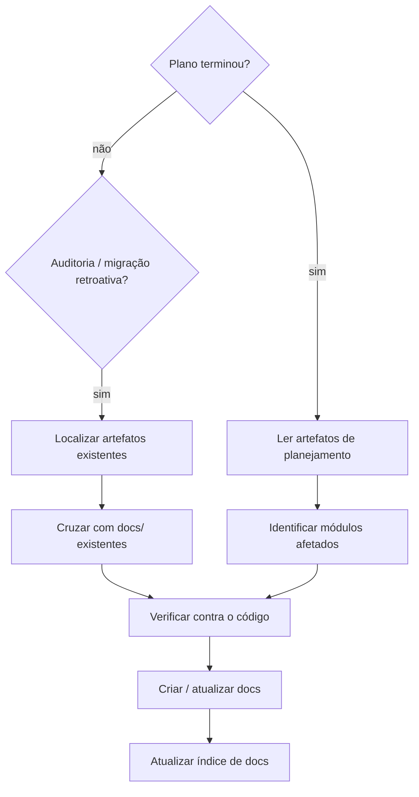

# Documentação Viva

Converte artefatos de planejamento (specs, planos, issues, PRs) em documentação estruturada e viva, fiel ao código
atual, não à intenção original do design.

**Princípio central:** docs descrevem o que o sistema *faz*, verificado no código. Descarte qualquer coisa que a spec
planejou mas o código não entregou.

## Escopo: o que merece doc

Doc é código que ninguém compila: ela só se paga quando responde uma pergunta que o leitor não consegue responder
lendo o repositório. Documentar demais gera o mesmo ruído que não documentar: o leitor deixa de confiar no conjunto
porque não sabe qual parte ainda é verdade.

Merece doc:

- **Arquitetura do sistema** e seus limites: o que roda dentro, quem entra, por onde.
- **Integrações externas**: com quem o sistema fala, por qual transporte, e o que acontece quando o outro lado falha.
- **Capacidades**: o que o sistema entrega para o usuário, em linguagem de negócio.
- **Regras de negócio core**: a regra que custa dinheiro, dado ou confiança quando violada.
- **Peças críticas e invariantes não-óbvias**: o que quebra o sistema quando alguém mexe sem saber.
- **Decisões arquiteturais com tradeoff real** (ADR).

Não merece doc:

- Detalhe de implementação interna, função privada, estrutura de pacote.
- Narrativa de mudança ("antes era X, agora é Y"), post-mortem, passo-a-passo de refactor.
- Cenário de comportamento em prosa (Dado/Quando/Então e afins). Comportamento se prova com teste; em markdown ele
  apodrece em silêncio e passa a mentir com aparência de contrato. Se vale descrever, vale um teste no lugar.
- Enumeração exaustiva de campo trivial, ou qualquer texto que repita o que o código já diz com clareza.

Ao encontrar doc que caiu nessa segunda lista, **delete**. Apagar é entrega.

## Artefato visual

Uma imagem explica arquitetura melhor que mil palavras, mas uma imagem binária não tem diff, não tem revisão e
envelhece sem ninguém notar.

- **Padrão: diagrama como texto** (mermaid no próprio markdown). Versionável, revisável no MR, editável por quem
  encostar no código.
- **Binário (png, jpg, mp4) ou HTML só quando o texto não consegue expressar**: captura de UI real, gravação de fluxo,
  desenho que nenhuma sintaxe de diagrama alcança. Isso é exceção, e custa peso no clone de todo mundo, para sempre.
- **Antes de commitar o primeiro binário**, configure o repositório para arquivo grande e registre isso no
  `.gitattributes`:

  ```
  git lfs track "docs/**/*.png"
  git lfs track "docs/**/*.mp4"
  ```

  Sem LFS configurado, não commite o binário: avise o usuário e mantenha o diagrama em texto.
- **Nunca** commite imagem que só reproduz o que uma tabela de cinco linhas já diz.

## Argumento: escopo por tipo

`ARGUMENTS: $ARGUMENTS`

| Argumento | O que fazer |
|-----------|-------------|
| vazio | **Todos os três tipos.** Percorra a documentação como um todo, sem escolher tipo por conta própria |
| `architecture` | Só `docs/architecture/overview.md` |
| `prd` | Só os `prd.md` dos módulos afetados |
| `adr` | Só os ADRs das decisões não-óbvias |

**Sem argumento:** a doc inteira está no escopo. Passe pelos três tipos na ordem `architecture` → `prd` → `adr` e, para **cada um**, tome uma decisão explícita: criar, atualizar ou nada a fazer. Nenhum tipo é
pulado em silêncio: "nada a fazer" é uma conclusão que você registra, não uma omissão. Ao terminar, relate uma linha
por tipo com o que aconteceu.

**Com um tipo nomeado:** carregue **apenas** o guideline daquele tipo e ignore os demais artefatos; inclusive não crie
docs de outros tipos "de brinde". Argumento não reconhecido: trate como vazio e avise em uma linha.

## Guidelines por tipo

Cada tipo tem template, regras e erros comuns em um arquivo próprio. Leia o do tipo que vai escrever, na hora de
escrever:

| Tipo | Onde mora | Guideline |
|------|-----------|-----------|
| Arquitetura | `docs/architecture/overview.md` | [references/architecture.md](references/architecture.md) |
| PRD | `docs/features/<modulo>/prd.md` | [references/prd.md](references/prd.md) |
| ADR | `docs/adrs/NNN-<titulo>.md` | [references/adr.md](references/adr.md) |

## Estrutura de Pastas

```
docs/
  architecture/
    overview.md                   # Visão macro do sistema, o topo da documentação
  adrs/
    NNN-<titulo>.md               # Um ADR por decisão arquitetural
  features/
    <modulo>/
      prd.md                      # Propósito de negócio e valor para o usuário
      <outro>.md                  # Qualquer doc adicional (diagramas, runbook, etc.)
```

**Nomes de módulo** mapeiam o domínio de negócio, não o pacote/diretório de código. Descubra os módulos lendo o
código; não assuma nomes.

## Processo



### Passo 1: Ler a fonte

Localize os artefatos de planejamento do projeto. Podem estar em:
- Diretório de specs/plans local (`docs/superpowers/`, `docs/specs/`, `docs/rfcs/`, etc.)
- Issues ou PRs do repositório
- Arquivos de design passados para a conversa

Para migração retroativa: processe em ordem cronológica. Artefatos mais recentes supersediam os mais antigos.

### Passo 2: Verificar contra o código

**Crítico:** o artefato de planejamento descreve intenção; o código é a verdade.

- Para cada afirmação, verifique se corresponde ao código atual
- Descarte decisões que foram alteradas ou nunca implementadas
- Use os nomes atuais do código (pacotes, env vars, endpoints), não os da spec

### Passo 3: Identificar o que foi afetado

Da fonte, liste:
- Quais módulos de domínio foram criados ou modificados
- Quais decisões arquiteturais foram tomadas (apenas tradeoffs não-óbvios)
- Se a mudança tocou um ponto de entrada, uma integração externa, um datastore ou o comportamento na falha de
  alguma dependência, nesse caso o overview de arquitetura entra na lista

### Passo 4: Criar ou atualizar docs

Comece pelo topo: `docs/architecture/overview.md`. Se o artefato não existe, crie; se existe, atualize o que divergiu.

Depois, para cada módulo afetado, na ordem: `prd.md` → ADRs.

Para cada artefato, leia o guideline correspondente na tabela acima antes de escrever.

**Nunca:** modificar os artefatos de planejamento originais (specs, planos, issues): são fonte histórica, não docs de
produto.

**Nunca:** criar links de docs para artefatos de planejamento que possam estar ausentes no repositório (gitignored,
externos, efêmeros).

### Passo 5: Atualizar o índice de docs

Encontre o índice de documentação do projeto (normalmente `docs/README.md` ou `docs/index.md`). Adicione novos
arquivos, remova referências a docs deletados, mantenha a seção de ADRs atualizada.

## Migração Retroativa

Quando invocado para auditar ou migrar documentação existente:

1. Localize todos os artefatos de planejamento disponíveis
2. Para cada artefato, identifique: módulo, decisões tomadas, comportamentos descritos
3. Cruze com `docs/architecture/`, `docs/features/` e `docs/adrs/` existentes
4. Para cada lacuna (conteúdo da spec ausente nos docs), verifique no código e escreva o doc
5. Para cada doc que contradiz o código atual, atualize
6. Se não há visão macro do sistema, comece por ela: sem o overview o leitor não tem por onde começar

**Descarte da spec se:**
- O código não implementa
- Foi marcado explicitamente fora de escopo
- Um artefato posterior o supersedeu

## Regras de Qualidade

| Regra | Por quê |
|-------|---------|
| Idioma dos docs = idioma do projeto | Consistência para a audiência real |
| Toda afirmação verificada contra o código | Previne divergência entre doc e código |
| Nomes sempre dos atuais no código | Artefatos antigos usam nomes desatualizados |
| Um artefato por responsabilidade | Cada tipo responde uma pergunta; sobreposição gera doc duplicada e divergente |
| Docs nunca linkam artefatos efêmeros | Links quebrados degradam a confiança na doc |
| Atualização preserva o que já está correto | Reescrever o doc inteiro perde contribuições de terceiros |

## Erros Comuns

| Erro | Correção |
|------|----------|
| Copiar spec verbatim para docs | Verificar primeiro; descartar o que o código não entregou |
| Usar nomes da spec (pacotes, env vars, paths) | Verificar nomes reais no código |
| Escrever um artefato sem ler o guideline dele | Cada tipo tem template e regras próprias em `references/` |
| Documentar features sem nenhuma visão macro | O overview é a porta de entrada dos demais docs |
| Criar docs de outros tipos quando um tipo foi pedido no argumento | Respeite o escopo do argumento |
| Não atualizar o índice de docs | Índice deve refletir todos os docs existentes |
| Linkar para artefatos gitignored/externos | Docs devem ser auto-contidos no repositório |
